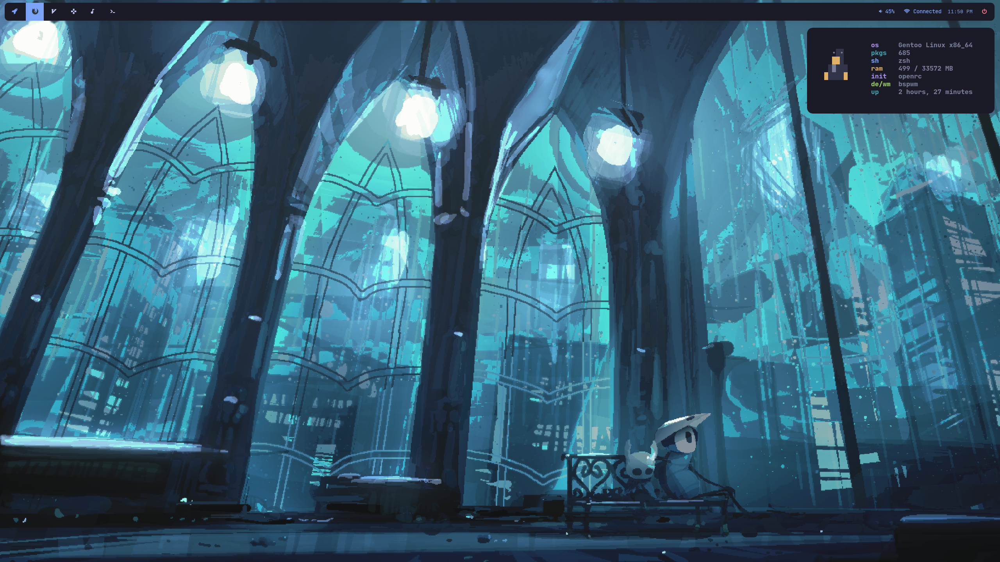

# 💎 my dots! 

## ☕  *Info*
- **OS:** [Gentoo](https://www.gentoo.org/)
- **Window Manager**: [bspwm](https://github.com/baskerville/bspwm)
- **Bar**: [polybar](https://github.com/polybar/polybar)
- **Terminal:** [alacritty](https://github.com/alacritty/alacritty)
- **Application Launcher:** [rofi](https://github.com/davatorium/rofi)

***
not optimized for use by others, may require changes
